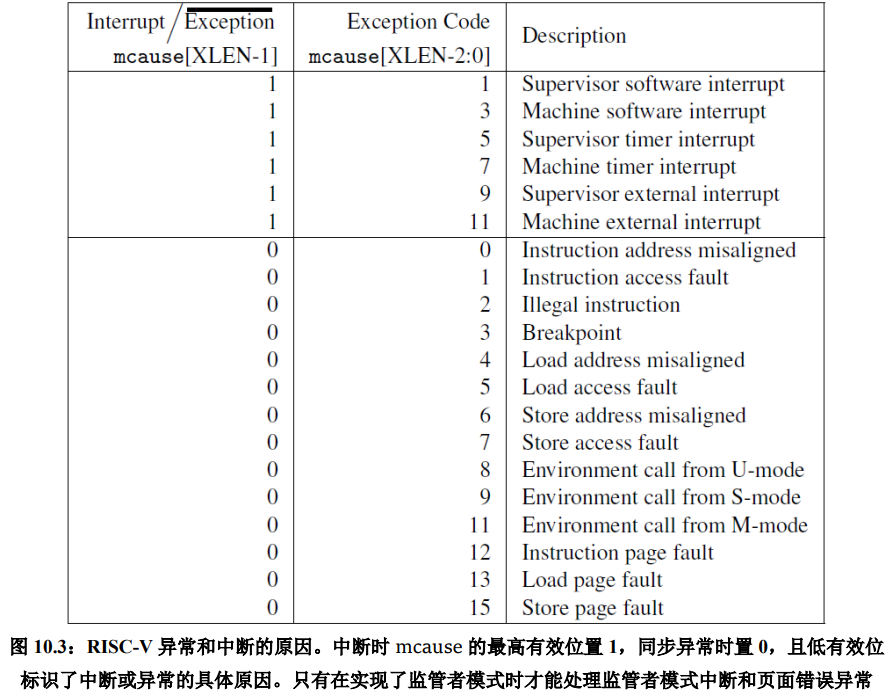
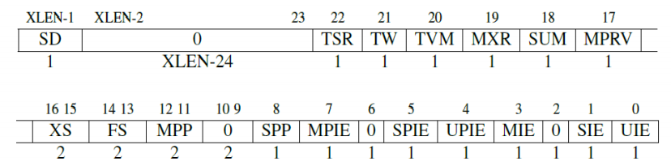

# Risc-V Simple Learning

## 诞生原因

* x86指令集爆发性增长
* 由于非商业，所以不会受到随意的更改
* 没有历史包袱
  * 例如x86还保留着BCD数据格式的操作指令，占据了操作码空间的1.6%（4/256）
* 模块化的ISA（核心是RV32I），可以根据自己的需求进行选择
  * x86由于是增量式的ISA，因此每次带有新指令的CPU必须也要实现旧指令。
* 简介的ISA，相比其他RISC架构指令集，实现同一功能可以进行更少的指令执行

## RV32/RV64的特权架构

### 机器模式（M）

机器模式是risc-v中的最高权限模式，具有对裸机的完整控制权，是所有RISC-V处理器必须实现的权限模式。

**特性**

* 拦截
* 异常处理
  * 同步异常（指令执行期间产生的，例如执行了不合规范的指令，或者访问了错误的内存地址等）
    * 访问错误异常  当物理内存地址不支持访问时（比如写入ROM）
    * 断点异常  在执行ebreak指令，或者地址或数据雨调试触发器匹配时发生
    * 环境调用异常  在执行ecall指令时发生
    * 非法指令异常  在译码阶段发现无效操作码时发生
    * 非对齐地址异常  在有效地址不能被访问大小整除时发生，例如地址为0x12的amoadd.w
  * 中断（与指令流异步的外部事件，比如鼠标移动等）

#### 异常处理

八个控制状态寄存器（CSR）是机器模式下异常处理的必要部分

* mtvec（Machine Trap Vector）它保存发生异常时处理器需要跳转到的地址。

* mepc（Machine Exception PC）它指向发生异常的指令。

* mcause（Machine Exception Cause）它指示发生异常的种类。

* mie（Machine Interrupt Enable）它指出处理器目前能处理和必须忽略的中断。

* mip（Machine Interrupt Pending）它列出目前正准备处理的中断。

* mtval（Machine Trap Value）它保存了陷入（trap）的附加信息：地址例外中出错的地址、发生非法指令例外的指令本身，对于其他异常，它的值为 0。

* mscratch（Machine Scratch）它暂时存放一个字大小的数据。

* mstatus（Machine Status）它保存全局中断使能，以及许多其他的状态

  

### 监管者模式（S）

### 用户模式（U）